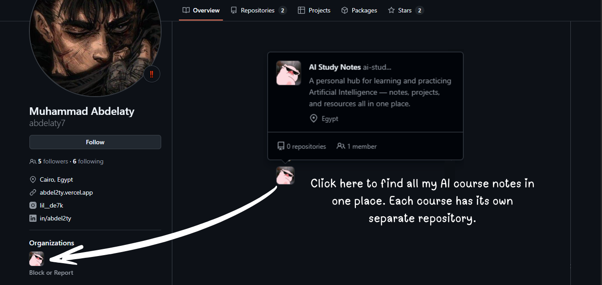

<h1>
  
  &nbsp;Full-Stack AI Engineer
</h1>

<h4>
  I'm passionate about combining web development with artificial intelligence to build innovative solutions. On my GitHub, I manage an organization focused on AI education, where I document my learning journey and share resources to make AI more accessible. While my personal repositories showcase diverse projects, all educational AI content is organized separately for clarity. My goal is to present my work through impactful websites—just as ChatGPT reached the world as a website-powered AI tool. I'm committed to continuing this journey, creating value, and leaving a real mark.
</h4>

<h3 align="left">
  
  &nbsp;AI Courses
</h3>

<table width="100%">
<tr>
<td width="25%">

#### **01. [AI for Everyone](https://www.coursera.org/learn/ai-for-everyone)**
###### by Andrew Ng • 5 hours

 

</td>
<td width="25%">

#### **[AI Python for Beginners](https://www.coursera.org/learn/ai-python-for-beginners)**
###### by Andrew Ng • 16 hours

 

</td>
<td width="25%">

#### **[Python by IBM](https://www.coursera.org/learn/python-for-applied-data-science-ai)**
###### by IBM • 22 hours

 

</td>
<td width="25%">

#### **[Math for ML](https://www.coursera.org/specializations/mathematics-for-machine-learning-and-data-science)**
###### by Andrew Ng • 93 hours

 

</td>
</tr>
<tr>
<td width="25%">

#### **[Statistics by IBM](https://www.coursera.org/learn/statistics-for-data-science-python)**
###### by IBM • 12 hours

 

</td>
<td width="25%">

#### **[Data Analysis](https://www.coursera.org/learn/data-analysis-with-python)**
###### by IBM • 12 hours

 

</td>
<td width="25%">

#### **[CS50's AI with Python](https://cs50.harvard.edu/ai/2024)**
###### by Brian Yu • 13 hours

 

</td>
<td width="25%">

#### **[Artificial Intelligence A-Z](https://www.udemy.com/course/artificial-intelligence-az)**
###### by SuperDataScience • 15.5 hours

 

</td>
</tr>
<tr>
<td width="25%">

#### **[ML Specialization](https://www.coursera.org/specializations/machine-learning-introduction)**
###### by Andrew Ng • 94 hours

 

</td>
<td width="25%">

#### **[Supervised ML](https://www.coursera.org/learn/machine-learning)**
###### by Andrew Ng • 32 hours

 

</td>
<td width="25%">

#### **[Advanced Learning Algorithms](https://www.coursera.org/learn/advanced-learning-algorithms)**
###### by Andrew Ng • 32 hours

 

</td>
<td width="25%">

#### **[Unsupervised Learning](https://www.coursera.org/learn/unsupervised-learning-recommenders-reinforcement-learning)**
###### by Andrew Ng • 27 hours

 

</td>
</tr>
<tr>
<td width="25%">

#### **[Machine Learning A-Z](https://www.udemy.com/course/machinelearning)**
###### by SuperDataScience • 43 hours

 

</td>
<td width="25%">

#### **[ML in Production](https://www.coursera.org/learn/introduction-to-machine-learning-in-production)**
###### by Andrew Ng • 10 hours

 

</td>
<td width="25%">

#### **[Neural Networks](https://www.coursera.org/learn/neural-networks-deep-learning)**
###### by Andrew Ng • 22 hours

 

</td>
<td width="25%">

#### **[DL Specialization](https://www.coursera.org/specializations/deep-learning)**
###### by Andrew Ng • 125 hours

 

</td>
</tr>
<tr>
<td width="25%">

#### **[ML Projects](https://www.coursera.org/learn/machine-learning-projects)**
###### by Andrew Ng • 5 hours

 

</td>
<td width="25%">

#### **[Convolutional NN](https://www.coursera.org/learn/convolutional-neural-networks)**
###### by Andrew Ng • 34 hours

 

</td>
<td width="25%">

#### **[Sequence Models](https://www.coursera.org/learn/nlp-sequence-models)**
###### by Andrew Ng • 35 hours

 

</td>
<td width="25%">

#### **[NLP Specialization](https://www.coursera.org/specializations/natural-language-processing)**
###### by Andrew Ng • 110 hours

 

</td>
</tr>
<tr>
<td width="25%">

#### **[Deep Learning A-Z](https://www.udemy.com/course/deeplearning)**
###### by SuperDataScience • 22.5 hours

 

</td>
<td width="25%">

#### **[Reinforcement Learning Specialization](https://www.coursera.org/specializations/reinforcement-learning)**
###### by University of Alberta • 73 hours

 

</td>
<td width="25%">

#### **[Python Handbook](https://drive.google.com/file/d/1Hu_Rd-spILyNWmoBw1HubHWrkmfz0zKh/view)**
###### Reference Material

 

</td>
<td width="25%">

#### **[Math for ML (PDF)](https://mml-book.github.io/book/mml-book.pdf)**
###### Reference Material

 

</td>
</tr>
<tr>
<td width="25%">

#### **[ZTM Cheat Sheets](https://zerotomastery.io/cheatsheets)**
###### Reference Material

 

</td>
<td width="25%">

#### **[eCommerce Figma Design](https://www.figma.com/design/GA9fjgPWclPfm8TTJ8ZQ8u/Clicon---eCommerce-Marketplace-Website-Figma-Template--Community---Community-?node-id=279-19819&p=f&t=B974A8QV6eit91iQ-0)**
###### Design Resource

 

</td>
<td width="25%">

#### **[eCommerce React.js](https://www.udemy.com/share/106hUE3@75sIdWv_927u6zSG7kLfmBk3QbcbwOPWg5prEd6YmaqamhSB46-us0K47-f3cUFPDA==/)**
###### by Mahmoud Baker • 67 hours

 

</td>
<td width="25%">

#### **[eCommerce Node.js](https://www.udemy.com/share/106ICA3@MdVRAK8ybqNDdOPmXQHQuZU0uVEp_J0CljxX7TnFJrvhgWHlZGDncTNJVHOswo_log==/)**
###### by Ahmed Bogdady • 33 hours

 

</td>
</tr>
<tr>
<td width="25%">

#### **[Node.js Back-end](https://www.udemy.com/share/10aFpa3@ewSlWT290gCoRfUgoDlvbXGJkPWvy9qWciP7ipA1Q8uJUcFLHEWJ5OFBrhensW_1dg==/)**
###### by Muhammad Naga • 39 hours

 

</td>
<td width="25%">

#### **[Data Structures & Algorithms](https://www.udemy.com/share/101qSq3@Hai2xIOJ0XvGYpUe8obJs9WqbaRPsSePZlRS0j8NLQHP3DTsO_seoHoUwI37qO-7MQ==/)**
###### by Andrei Neagoie • 20 hours

 

</td>
<td width="25%">

#### **[SOLID Principles](https://www.udemy.com/share/10bQKj3@Zc3RLliNic7mQgylPL7t1nv6HEd0iWIErkjCz02NqDSJ65mEjI_i0-2KsrPSQJI6AQ==/)**
###### by Mohamed Tamer • 1.5 hours

 

</td>
<td width="25%">

#### **[Oracle Database](https://www.udemy.com/share/10c6dz3@qX0GnN5dv_Z63kmebDb1Jga--dGfy2rRbNoavdvDWt__2_5JyBDuA-fkJIvpdbwd8Q==/)**
###### by Mohamed Tamer • 10.5 hours

 

</td>
</tr>
<tr>
<td width="25%">

#### **[Power BI](https://www.youtube.com/playlist?list=PL-qR2lCbzf-qKcSx6v7IVz30G5A711xKA)**
###### by Fouad Zawadi • 6.5 hours

 

</td>
<td width="25%">

</td>
<td width="25%">

</td>
<td width="25%">

</td>
</tr>
</table>

  
  
  &nbsp;&nbsp;&nbsp;
  
  &nbsp;&nbsp;&nbsp;
  
  &nbsp;&nbsp;&nbsp;
  
  

   
##### Made with ❤️️ by Abdelaty. 
   

